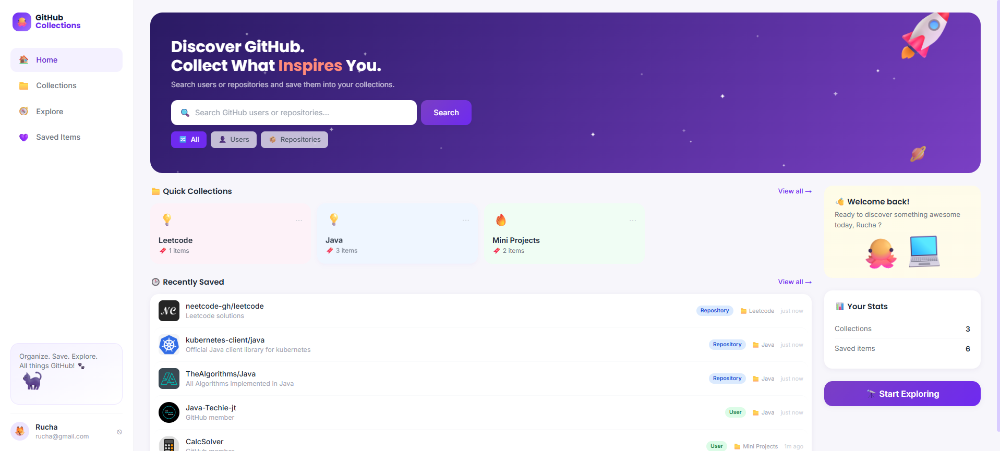

# 🐙 Code Vault

Search GitHub profiles and repositories, view their details, and save them into
your own custom collections — like Pinterest, but for GitHub.

  

## Preview



## ✨ Features

- 🔐 Sign up / log in (JWT-based auth, passwords hashed with BCrypt)
- 🔍 Search GitHub users and repositories via the GitHub REST API
- 👀 View basic profile / repository details (avatar, bio/description, stars, followers, language...)
- 📁 Create, rename, and delete custom collections (folders)
- 🔖 Save any profile or repo into one or more collections
- 🗑️ Remove saved items from a collection
- 🧑‍🤝‍🧑 Everything is scoped per user — your collections are private to your account
- 🚪 Logout

## 🧱 Tech stack

| Layer     | Technology                          |
|-----------|--------------------------------------|
| Frontend  | React 18 + Vite + Tailwind CSS + React Router |
| Backend   | Java 17 + Spring Boot 3 (Web, Security, Data JPA, Validation) |
| Database  | MySQL |
| Auth      | JWT (jjwt) + BCrypt |
| External  | GitHub REST API (public, no login required to search) |

## 🚀 Getting started

### Prerequisites

- Java 17+
- Maven 3.8+ (or use your IDE's built-in Maven)
- Node.js 18+ and npm
- MySQL 8 running locally (or update the connection string to point elsewhere)

### 1. Set up the database

You don't need to manually create tables — Hibernate does that for you. Just make
sure a MySQL server is running and either:

- create an empty database named `github_collections`, **or**
- leave it as-is: the default connection string uses
  `?createDatabaseIfNotExist=true`, so it will be created automatically the
  first time the backend starts (as long as the MySQL user has permission).

```sql
CREATE DATABASE IF NOT EXISTS github_collections;
```

### 2. Configure & run the backend

Edit `backend/src/main/resources/application.properties` if your MySQL
username/password differ from the defaults (`root` / `root`):

```properties
spring.datasource.username=root
spring.datasource.password=root
```

Optional: add a [GitHub personal access token](https://github.com/settings/tokens)
to `github.api.token` to raise the GitHub API rate limit from 60 to 5,000
requests/hour (not required to run the app).

Then run:

```bash
cd backend
mvn spring-boot:run
```

The API starts on **http://localhost:8080**.

### 3. Run the frontend

```bash
cd frontend
npm install
npm run dev
```

The app starts on **http://localhost:5173**. Copy `.env.example` to `.env` if
you need to point the frontend at a different backend URL.

### 4. Use it

1. Open http://localhost:5173
2. Sign up for an account
3. Go to **Explore**, search for a GitHub user or repo
4. Click **🔖 Save**, pick or create a collection
5. Browse your **Collections** and **Saved Items** any time

## 🎨 Design notes

The UI intentionally mirrors a "collect the best of GitHub" theme: a starry
purple hero banner, playful emoji icons instead of generic dashboard icons,
and soft pastel collection cards — built to feel fun and approachable rather
than like a boring admin panel.

## 🧩 Notes for beginners

- No advanced features (no OAuth, no real-time sync, no complex roles) —
  just the CRUD + search flow described above, kept intentionally simple.
- The backend proxies GitHub's public REST API directly, so the JSON shape
  saved/displayed matches GitHub's own API fields (`login`, `avatar_url`,
  `full_name`, `stargazers_count`, etc).
- `spring.jpa.hibernate.ddl-auto=update` means you never have to write SQL
  migrations for this project — just start the backend and the schema
  appears.
